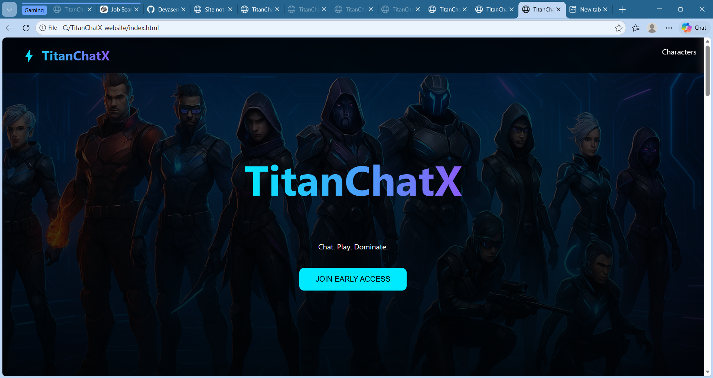

# TitanChatX

Chat. Play. Dominate.

TitanChatX is a futuristic platform concept that combines real-time messaging with immersive multiplayer gaming.

The goal of TitanChatX is to create a next-generation communication ecosystem where users can chat with friends and instantly jump into competitive gameplay.

---

## Features

• Real-time messaging platform  
• Integrated Battle Royale gameplay  
• Character-based abilities  
• Weapon skill system  
• Game progression system  
• Subscription model for premium features  

---

## Game Modes

**Battle Royale**
Large-scale survival matches where players compete to be the last one standing.

**Clash Squad**
Fast tactical team battles focused on teamwork and strategy.

**Training Grounds**
Practice mode for learning weapons, abilities, and gameplay mechanics.

---

## Game World

TitanChatX features a futuristic island map including:

• Nova City  
• Plasma Forest  
• Valkyrie Crater  
• Sentinel Base  

These zones create diverse combat experiences and strategic gameplay.

---

## Subscription Model

Weekly Plan – ₹500  
Monthly Plan – ₹1000  
Yearly Plan – ₹1800  

Premium players gain access to exclusive skins, events, and rewards.

---

## Website

Early access waitlist is available on the TitanChatX website.

Players can join the waitlist to receive updates and early access to the platform.

---
## TitanChatX Website Preview

## Vision

TitanChatX aims to merge social interaction and competitive gaming into a single powerful platform.

The project explores how communication and entertainment can coexist seamlessly in a unified digital experience.

---

## Author

Devasena K  
Founder – TitanChatX
